# Hi 👋, I'm Peter Donniel P. Villanueva

### Creative Web Developer

---

## 🧠 My focus areas

- Web development  
- Web animations & interactions  
- Immersive web experiences  

---

## 📊 GitHub stats & activity

  
  &nbsp;
  

  

  

  

  

---

## 🛠️ Main skills

  
  
  
  
  
  
  
  
  

  
  
  
  
  
  
  
  

  
  
  
  
  
  
  
  

  
  
  
  
  
  
  
  

---

  Icons from <a href="https://skillicons.dev">skillicons.dev</a> · Stats: <a href="https://github.com/anuraghazra/github-readme-stats">github-readme-stats</a> · Streak: <a href="https://github.com/DenverCoder1/github-readme-streak-stats">streak-stats</a> · Calendar: <a href="https://ghchart.rshah.org">ghchart</a>

