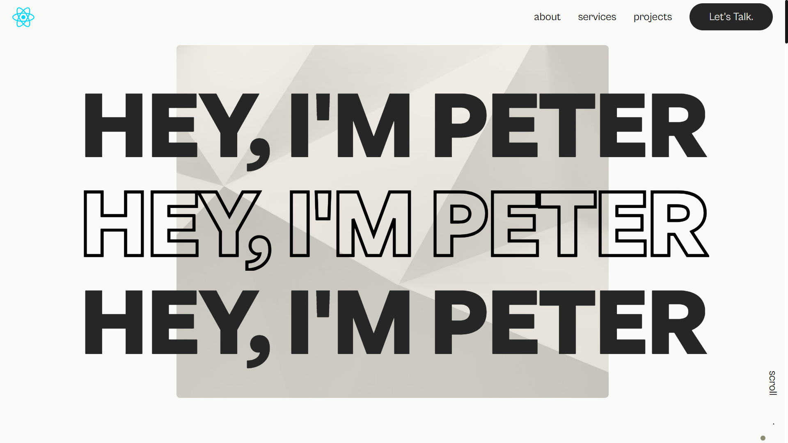

<!-- 

  <ul align="center" style="list-style: none;">
    

      <h1>Peter Donniel P. Villanueva</h1>
      <h2>A College Student and Aspiring Web Developer from Philippines</h3>
    

  </ul>

 -->

  <ul align="center" style="list-style: none;">
    

        <h1><strong>Peter Donniel P. Villanueva</strong></h1>
    

  </ul>

  <ul style="list-style: none;">
    

      <h1>GitHub stats & activity</h1>
    

  </ul>

  <a href="https://github.com/PeterVillanueva">
    %20GitHub%20Stats&border_color=9BE9A8" alt="GitHub stats"/>
  </a>
  

  

  

  <ul style="list-style: none;">
    

      <h1>Main skills</h1>
    

  </ul>

  
  
  
  
  
  
  
  
  
  
  
  
  
  
  
  
  
  
  
  
  
  
  
  
  
  
  
  
  
  
  
  
  
  
  
  
  
  
  
  

